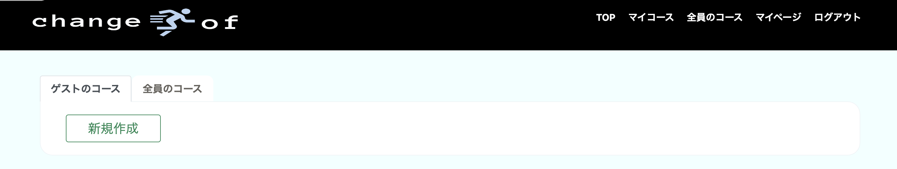
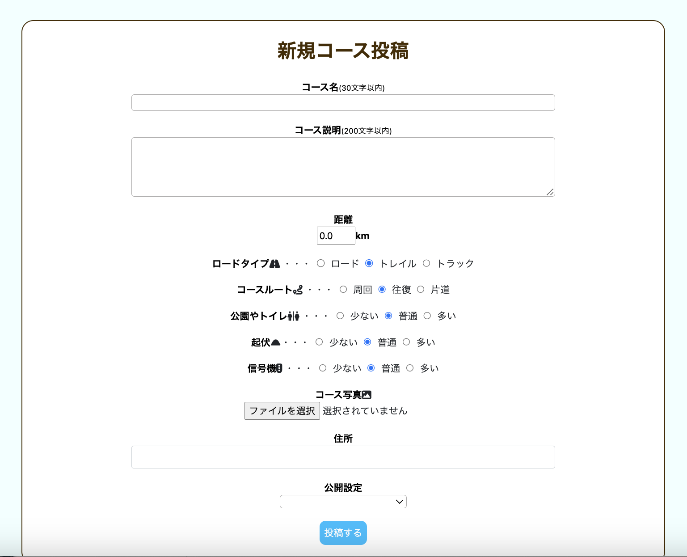
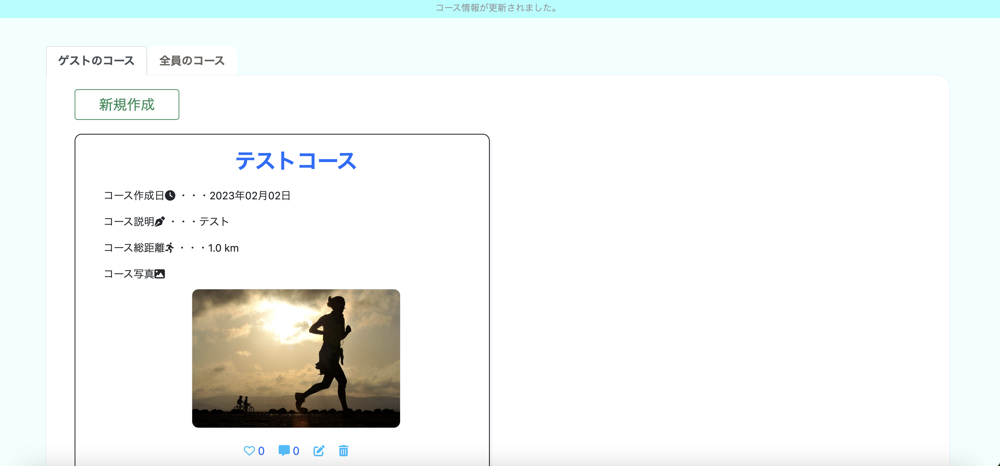
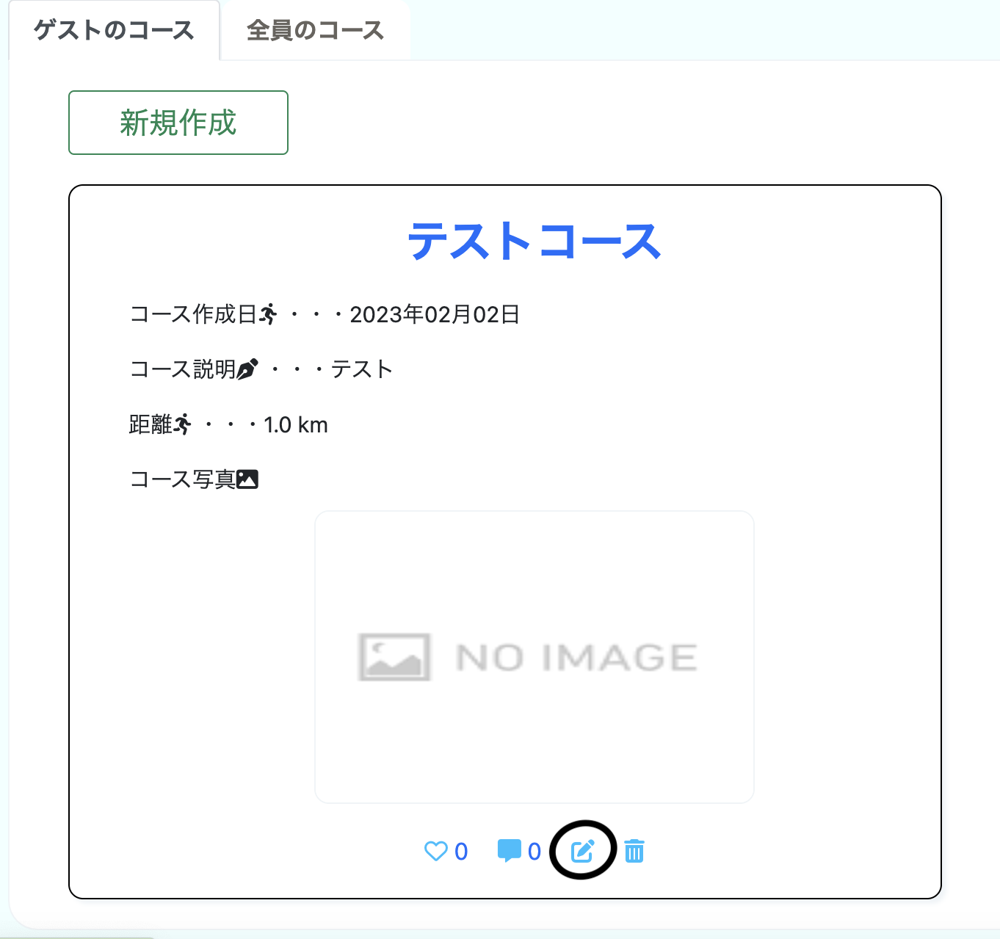
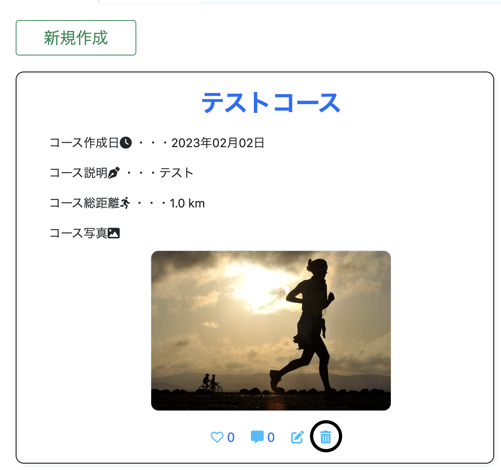
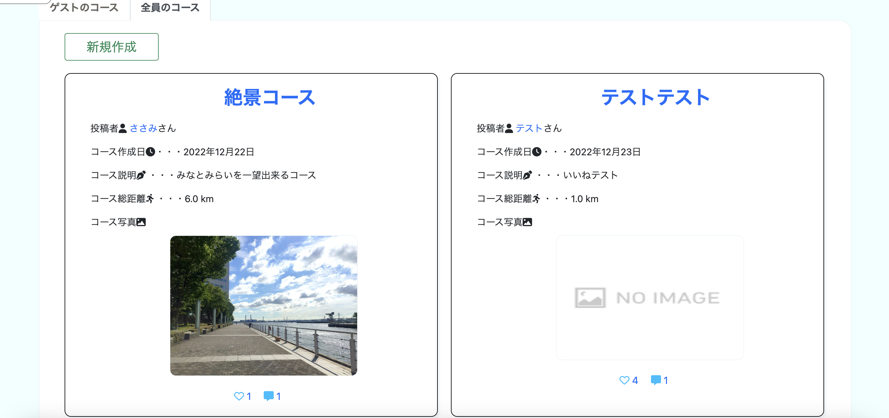
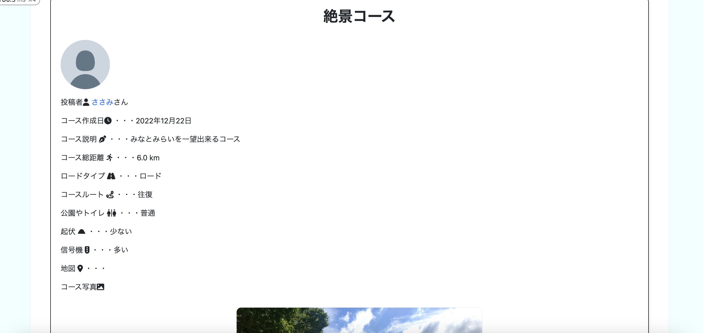
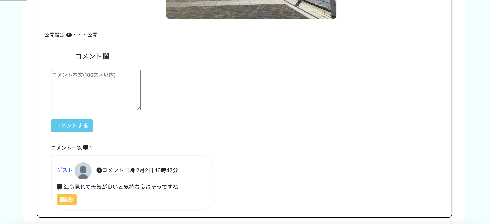
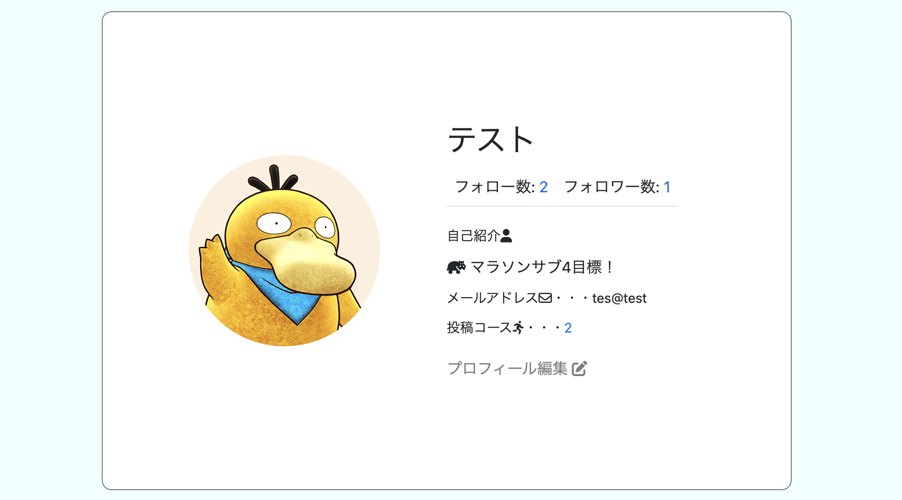
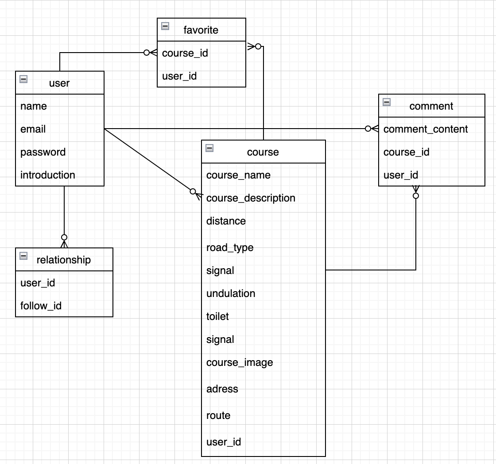

 
# はじめに
"Chage Of Run"はランナーが”気分転換”したい時にランニングコースの投稿や参考にする事の出来るアプリケーションです。  
私自身ランニングを趣味として走っておりますが、一人で走っている事もありいつも同じコースばかりでランニング仲間と
走る機会も少なくなかなかモチベーションの維持というのが難しい事があります。 
そのような中で、”自分自身のランニングコースを何個も持っていて更にはそれを同じランナー共有しモチベーションを更に
上げて共有出来る事が出来れば良い”と思い、このアプリの開発を考案致しました。  
コースの投稿を行なう事で自分のマイコースを見て”今日はこのコースを走ろう”や”今日はこの人の投稿したコースを参考に
走ってみよう”といった変化、”気分転換”をしながら、ユーザーとコメントでコミュニケーションを取る事も可能になっており、
同じ気持ちを抱いているランナー同士でのモチベーションの共有も出来ると考えております。

# 開発環境
macOS 13.1  
Ruby 2.7.3  
Ruby on Rails  6.1.6.1  
MySQL 8.0.31  
Docker 20.10.17  
Bootstrap 5.0.2
Rspec  
Visual Studio Code  
## デプロイ方法
AWS

# Chage Of Runの機能紹介

　
### 1 ランニングコースの作成

自分のコースを作成してみましょう。
ヘッダーから「マイコース」か「全員のコース」を選択し
  
左上にある"新規"ボタンを押すとランニングコースの新規作成画面に遷移します。
必要項目を埋めていきましょう。
  
**他のユーザーに見られたくない場合は、公開設定の欄で"非公開"を選択する事も可能です。**

必要項目を全て埋めたら"投稿する"ボタンを押して、保存しましょう。  

### 1.1 マイコース一覧

コース作成後、自分のコース一覧ページに遷移します。  
この画面で先ほど作成したコースを確認することができます。
 

### 1.2 ランニングコースの編集
自分が作成したコースは、下の編集アイコンをクリックすることで内容を編集することができます。
 
 

### 1.3 ランニングコースの削除
右下のゴミ箱アイコンをクリックすると、コースを削除することができます。  
 

### 1.4 全員のコース一覧
メニュータブの"全員のコース"をクリックすると、設定が"公開"になっている全てのリストを見ることができます。
他のユーザーのリストを参考にして、日々のランニングを"Chage Of Run"しましょう。
マイコースでも同様にですが、下にはいいねアイコンやコメントアイコンもあり、コースに対していいね！
を押す事が可能です。

 

## 2"コース詳細"
コース名をクリックすると、ランニングコースの詳細を見ることが出来ます。
コース投稿者やこのコースの特徴、このコースに対してのコメントを見る事が出来ます。

 

### 2.1 コメント機能
コース詳細画面の下部にはこのコースに対してコメントする事が出来ます。
誰がコメントしたかも確認出来るので、コミュニケーションを取る事も出来ます。
コメントを確認出来る事で日々のランニングへのモチベーションもコースの投稿も
進んで出来ると考えております。

 

## 3. "ユーザー画面"

### 3.1 ユーザー情報確認
ヘッダーにある「マイページ」をクリックすると、ユーザー情報画面に遷移します。  

ここでは自分の基本情報や自己紹介、投稿コースの数などを確認することができます。
他のユーザーの場合はメールアドレスは表示されません。  

### 3.2 プロフィール写真を登録する
"プロフィール編集"をクリックするとプロフィール編集画面に遷移します。  

ぜひ自分のプロフィール写真と自己紹介を登録しましょう。   
登録したプロフィール写真と自己紹介は、"コース詳細"や"フォロー・フォロワー画面"で自分のアイコンとして表示されます。

### 3.3 フォロー・フォローワー機能
”全員のコース”や”コース詳細”でユーザー情報が表示されていますが、そのユーザー名をクリックすると
そのユーザーの画面に遷移します。ユーザー情報にフォロー・フォロワーが確認出来ます。

# モデル一覧

# 今後の開発計画
1. ランニングコースの検索機能追加
2. コースの並べ替え機能追加（ex:コース作成日順、距離順）
3. コースルートの登録
etc...
